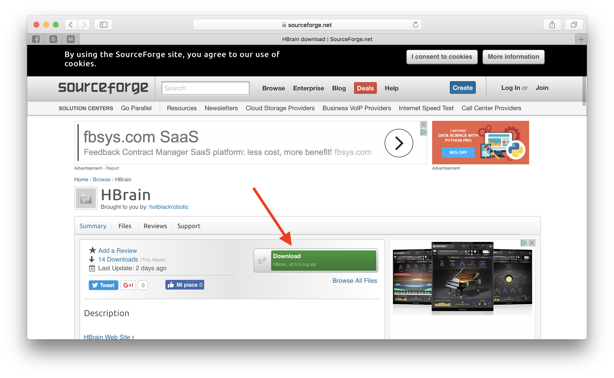

#Capitolo 1. Configurare il Raspberry

Questo capitolo è dedicato alla configurazione del Raspberry Pi per iniziare a sviluppare applicazione di Cloud Robotics utilizzando la piattaforma robotica di **HotBlack Robotics**. 

##Scheda SD del Raspberry Pi

Il primo passo, consiste nel configurare la scheda SD che contiene il sistema operativo **HBrain**. 
La scheda SD è l'Hard Disk del Raspberry Pi. È il componente principale che abilita la parte software del Raspberry, ed è quindi essenziale per il funzionamento del sistema stesso. Un Raspberry Pi senza una scheda SD correttamente configurata semplicemente non funziona.

La procedura di configurazione della scheda permette, essenzialmente, ci copiare all'interno della SD un sistema operativo già configurato e funzionante, a partire da una copia digitale di tale sistema (detta immagine). Ovviamente nulla vieta di crearsi il proprio sistema operativo, ma è un'operazione molto sconsigliata in quanto richiede forti competenze Linux.

Quello che andremo a fare, sarà quindi scaricare e clonare all'interno della SD che andremo ad inserire nel Raspberry, l'immagine del sistema operativo HBrain, che è il sistema operativo sviluppato da HotBlack Robotics, già configurato per funzionare con ROS e la piattaforma **HBR**.

Questa procedura cambia in base al sistema operativo utilizzato (Windows, Linux o macOS). Vediamo quindi come fare.

###Download dell'immagine della SD
Per scaricare l'immagine SD accedete a questo [link](https://sourceforge.net/projects/hbrain/) e scaricare l'ultima versione del'immagine cliccando sul tasto **Download**.

Il download richiederà un po' di tempo, in quanto il file da scaricare pesa più di 1GB di dati.

Una volta scaricato, è necessario coinfigurarlo seguendo la guida relativa al vostro sistema operativo, seguendo le guide sotto.

###Installazione immagine SD su Windows 

La procedura di installazione su Windows è molto facile.

###Installazione immagine SD su macOS

TBW

###Installazione immagine SD su Linux

TBW